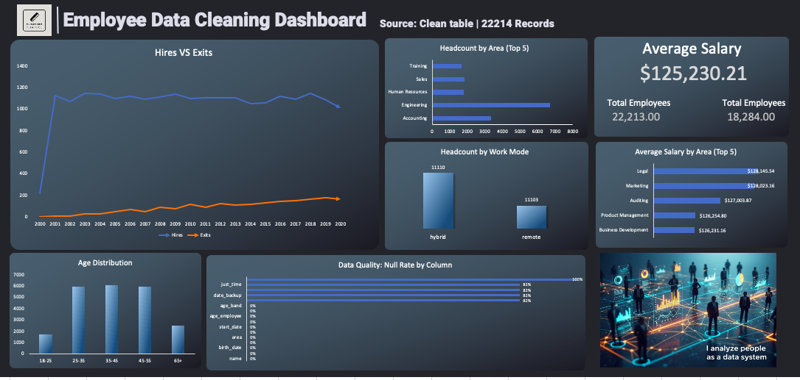

# Workforce Data Cleaning with MySQL & Excel KPI Dashboard

> A portfolio case study demonstrating employee-data preparation with MySQL and workforce reporting in Excel, from a raw CSV dataset to SQL-based cleaning steps and analytical outputs.


## Project Overview

Organizations often receive employee information in CSV files that need cleaning before they can be used for reporting. Common preparation tasks include inspecting duplicate rows, trimming whitespace, normalizing categorical values, converting salaries into numeric fields, and standardizing date formats.

This repository documents a **workforce data cleaning and reporting exercise** using:

- A source dataset: `ORIGINAL_DATA.csv`
- Individual SQL scripts written for **MySQL**
- Two exported CSV files with employee counts by area
- An Excel KPI dashboard and a screenshot of its presentation

The files demonstrate SQL transformation techniques and an Excel reporting deliverable. **They do not constitute an automated Python pipeline, a SQL Server solution, or a fully tested one-command ETL application.**

## Business Objective

Prepare employee-related source data for clearer analysis and reporting. The SQL examples cover data-quality checks, transformation steps, and summary queries that can support workforce analytics.

This is a **portfolio/learning project**, not a claim of client delivery or production deployment.

## Workflow at a Glance


**Important:** the diagram illustrates the intended analytical workflow. The repository contains separate SQL scripts and reporting files, not code that automatically imports the CSV into MySQL or refreshes the Excel workbook end to end.

## Main Techniques Demonstrated

| Area | What the SQL scripts cover |
|---|---|
| Source inspection | Querying the staging data and inspecting table metadata |
| Duplicate analysis | Counting repeated employee IDs and creating a table with distinct rows |
| Whitespace cleaning | Applying `TRIM` and regular-expression replacement |
| Category standardization | Mapping source gender and work-mode values to normalized labels |
| Numeric conversion | Removing currency symbols and separators before converting salary values |
| Date standardization | Parsing differing date representations and deriving an age field |
| Text derivation | Building an email-style field from name and work-mode information |
| Reporting queries | Selecting relevant employee columns and counting employees by area |

These are **examples of data cleaning and transformation logic**, not evidence of automated data-quality testing or production-grade validation. The email script **generates a field**; it does not verify that an email address is deliverable.

## SQL Files

The numbered SQL scripts are stored in the **repository root**, not in a `sql/` folder.

| Step | File | Focus |
|---|---|---|
| 1 | `1_CREATE_TABLE_AND_STORE_PROCEDURE.sql` | Database context and stored procedure examples |
| 2 | `2_CHANGE_COLUMN_HEADINGS.sql` | Renaming staging-table columns |
| 3 | `3_IDENTIFY_DUPLICATES.sql` | Duplicate checks and distinct-row table creation |
| 4 | `4(METADATA).sql` | Table metadata inspection |
| 5 | `5_WHITESPACE_NOTMALIZATION.sql` | Whitespace normalization |
| 6 | `6_FIND_AND_REPLACE.sql` | Category and text value replacement |
| 7 | `7_FORMAT_TEXT_INTO_NUMBERS.sql` | Salary conversion |
| 8 | `8_DATE_FORMAT.sql` | Date parsing and derived date fields |
| 9 | `9_TEXT_FUNCTION.sql` | Derived email-style text field |
| 10 | `10_CREATING_AND_EXPORTING_FINAL_DATA.sql` | Employee selections and counts by area |

The scripts use **MySQL-specific syntax**, including `DELIMITER`, `STR_TO_DATE`, `TIMESTAMPDIFF`, and `REGEXP_REPLACE`. They are not T-SQL scripts for Microsoft SQL Server.

### Execution Considerations

The SQL files document development steps rather than a fully reproducible migration:

- A staging table named `empleados_staging` and an appropriate source schema must be prepared separately.
- Some scripts reference intermediate tables or stored procedures created in other steps. Their exact dependencies and execution order must be reviewed before running them.
- Several statements rename, update, create, or drop tables. **Do not execute them against important data without a backup and a disposable test environment.**
- Results depend on the input data, MySQL version, and actual table definitions.

No end-to-end execution or database integration test is claimed by this README.

## Reporting Outputs

### Excel KPI Dashboard

The repository contains an Excel workbook for the reporting/presentation stage:

[Open the Excel dashboard file](excel/etl_kpi_dashboard.xlsx)

### Dashboard Preview



[View the dashboard image directly](screenshots/dashboard_overview.png)

The screenshot and workbook are included as portfolio artifacts. Their presence does not, by itself, establish an automatically refreshed link between MySQL and Excel.

### Exported Summaries

The folder `11_CREATING _AND_EXPORTING_THE_FINAL DATA/` contains:

- `number_of_employyes.csv`
- `select_relevant _data.csv`

Both files currently contain a two-column employee-count-by-area summary (`area`, `total_employee`). They should not be interpreted as two different datasets solely because their file names differ.

## Repository Structure

```text
ETL_proyect/
├── .gitignore
├── README.md
├── ORIGINAL_DATA.csv
├── 0_CSV_ENCODING_AND_PREPROCESSING.rtf
├── 1_CREATE_TABLE_AND_STORE_PROCEDURE.sql
├── 2_CHANGE_COLUMN_HEADINGS.sql
├── 3_IDENTIFY_DUPLICATES.sql
├── 4(METADATA).sql
├── 5_WHITESPACE_NOTMALIZATION.sql
├── 6_FIND_AND_REPLACE.sql
├── 7_FORMAT_TEXT_INTO_NUMBERS.sql
├── 8_DATE_FORMAT.sql
├── 9_TEXT_FUNCTION.sql
├── 10_CREATING_AND_EXPORTING_FINAL_DATA.sql
├── 11_CREATING _AND_EXPORTING_THE_FINAL DATA/
│   ├── number_of_employyes.csv
│   └── select_relevant _data.csv
├── excel/
│   └── etl_kpi_dashboard.xlsx
└── screenshots/
    ├── dashboard_overview.png
    └── Data_•_Analytics_•_Workforce_202605011212.jpeg
```

## How to Explore the Project

1. Clone the repository:

   ```bash
   git clone https://github.com/darwincamacho/ETL_proyect.git
   cd ETL_proyect
   ```

2. Review `ORIGINAL_DATA.csv` and the preprocessing notes in `0_CSV_ENCODING_AND_PREPROCESSING.rtf`.
3. Read the numbered MySQL scripts to understand the transformation steps. If you choose to run them, first prepare a separate MySQL environment and check their dependencies and potentially destructive statements.
4. Open `excel/etl_kpi_dashboard.xlsx` to inspect the reporting workbook.
5. View `screenshots/dashboard_overview.png` for the dashboard preview.

The workbook can be inspected independently of running the SQL scripts. There is no command in this repository that automatically builds every output from scratch.

## Tools

| Tool | Purpose |
|---|---|
| MySQL / SQL | Data inspection, cleaning, transformation, and summarization |
| CSV | Raw input and exported summary files |
| Microsoft Excel | KPI reporting workbook |
| GitHub | Project files, screenshots, and documentation |

**Not part of the implemented pipeline:** Python automation, Power BI reports, SQL Server ETL, or an orchestration scheduler.

## Data Privacy and Reuse

Employee-related datasets can contain personal information. **The provenance, consent, and anonymization status of `ORIGINAL_DATA.csv` have not been independently verified as part of this documentation update.** Review the dataset before reusing it, sharing it further, or publishing additional extracts.

Do not add production credentials or private employee data to this repository.

## Potential Improvements

Future enhancements could include:

- A reproducible staging-table import script and a verified run order.
- Automated duplicate and data-quality checks.
- Explicit KPI definitions and reconciliation tests.
- Automated workbook refresh or a Python orchestration layer.
- Sanitized demonstration datasets and a documented data dictionary.

These are **possible future improvements**, not current features.

---

**Portfolio focus:** MySQL data cleaning, CSV preparation, workforce summaries, and Excel reporting.
