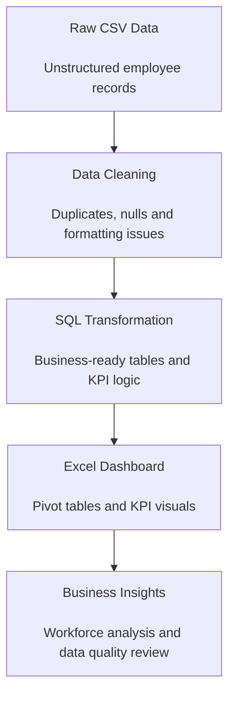
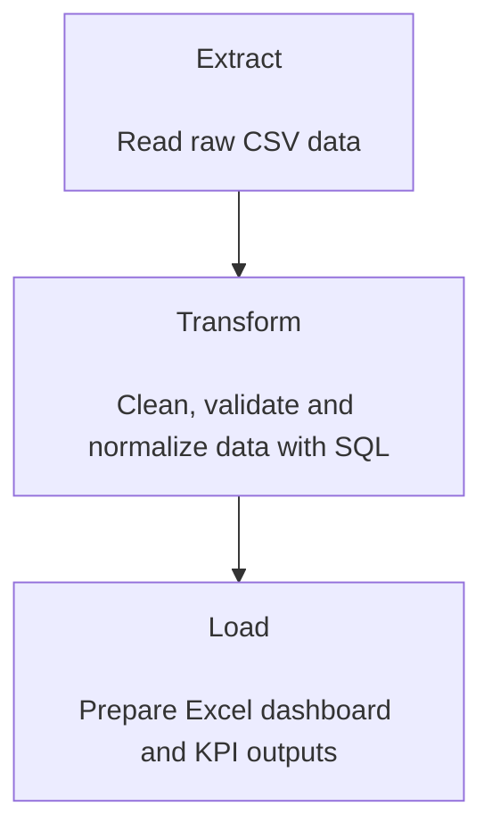
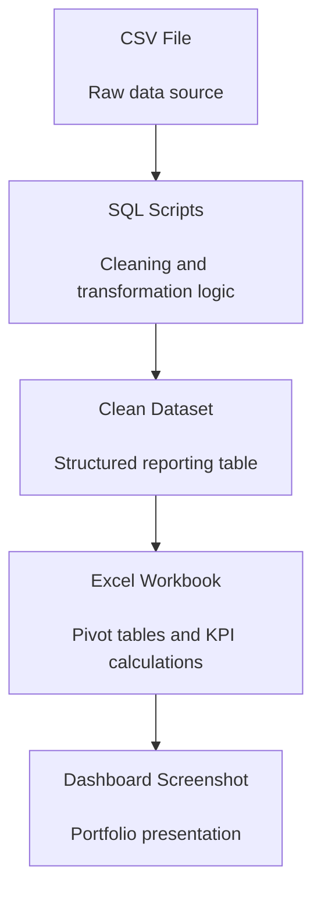

# ETL Data Cleaning and KPI Dashboard

> End-to-end ETL and business intelligence project focused on transforming raw CSV data into a clean dataset and an Excel KPI dashboard for business analysis.


## Executive Summary

ETL Data Cleaning and KPI Dashboard is a portfolio project that demonstrates how raw operational data can be transformed into structured business insights.

The project starts with a raw CSV file, applies data cleaning and transformation logic using SQL, and produces a business-ready Excel dashboard with key performance indicators.

The objective is to simulate a real-world data workflow where inconsistent source data must be cleaned, validated, structured and converted into a reporting asset for business users.

This repository is presented as a portfolio project for Data Analyst, BI Analyst and Junior Analytics Engineer roles.

## Process Workflow



## Portfolio Case

| Category | Description |
|---|---|
| Industry | Human Resources / Business Operations |
| Business Area | Workforce Analytics |
| Main Problem | Raw employee data requires cleaning before analysis |
| Solution Type | ETL workflow and KPI dashboard |
| Data Source | CSV file |
| Transformation Layer | SQL |
| Reporting Output | Excel dashboard |
| Target Roles | Data Analyst, BI Analyst, Analytics Engineer Jr |

## Business Problem

Organizations often receive operational data in raw formats such as CSV files.

Before this data can be used for reporting, it usually requires cleaning, validation and transformation.

Common issues include:

- Duplicate records.
- Missing values.
- Inconsistent formatting.
- Invalid email fields.
- Unstructured categorical values.
- Columns that are not ready for KPI calculation.
- Lack of a clean reporting table.

Without an ETL process, business users may rely on inconsistent spreadsheets, manual corrections and unreliable KPI calculations.

This project addresses that problem by transforming raw employee data into structured insights through SQL and Excel.

## Solution Overview

The project implements a simple but complete ETL workflow.

The solution:

- Ingests raw employee data from a CSV file.
- Cleans and normalizes the dataset.
- Handles duplicates and formatting issues.
- Applies SQL transformations.
- Prepares a structured dataset for reporting.
- Builds KPI calculations in Excel.
- Creates an Excel dashboard for workforce analysis.
- Includes screenshots to present the final business output.

The result is a clean reporting workflow that connects raw data preparation with business intelligence delivery.

## Business Value

This project provides value by:

- Improving data quality before reporting.
- Reducing manual spreadsheet cleanup.
- Creating consistent KPI definitions.
- Supporting workforce analysis through a structured dashboard.
- Making HR and operational indicators easier to review.
- Demonstrating how SQL and Excel can be combined in a practical BI workflow.
- Providing a reusable ETL pattern for small and medium-sized business reports.

## ETL Process

The ETL process follows three stages:



### Extract

The source data is ingested from a CSV file.

The raw dataset represents employee or workforce-related information used to calculate business indicators.

### Transform

The transformation phase applies SQL logic to prepare the data for analysis.

This includes:

- Removing duplicate records.
- Standardizing formats.
- Handling missing values.
- Validating email fields.
- Normalizing categorical fields.
- Preparing clean columns for KPI calculation.

### Load

The cleaned dataset is used to build an Excel dashboard.

The final output includes KPI calculations, pivot tables and dashboard visuals.

## Key KPIs

| KPI | Description |
|---|---|
| Total Employees | Total number of employee records analyzed. |
| Active Employees | Number of employees classified as active. |
| Average Salary | Average salary calculated from the cleaned dataset. |
| Average Tenure | Average employee tenure. |
| Headcount by Area | Employee distribution by business area. |
| Work Mode Distribution | Distribution by work mode, such as remote, hybrid or on-site. |
| Age Distribution | Employee distribution by age range. |
| Null Rate | Percentage of missing values detected in relevant fields. |
| Email Validation | Identification of valid and invalid email formats. |

## Dashboard Overview

The final dashboard was built in Excel using the cleaned and structured dataset produced by the ETL process.

The dashboard includes:

- KPI cards.
- Pivot tables.
- Workforce distribution analysis.
- Data quality indicators.
- Visual summaries for business review.

Dashboard file:

```text
/excel/etl_kpi_dashboard.xlsx
```

Screenshot:

```text
/screenshots/dashboard_overview.jpeg
```


## Technical Architecture



## Tools Used

| Tool | Purpose |
|---|---|
| SQL | Data cleaning, validation and transformation |
| Excel | Dashboard creation, KPI calculation and pivot tables |
| Git | Version control |
| GitHub | Portfolio documentation and project presentation |

## Repository Structure

```text
etl-data-cleaning-kpi-dashboard/
│
├── README.md
│
├── data/
│   ├── raw/
│   ├── processed/
│   └── README.md
│
├── sql/
│   └── data_cleaning_transformation.sql
│
├── excel/
│   └── etl_kpi_dashboard.xlsx
│
├── screenshots/
│   └── dashboard_overview.jpeg
└── .gitignore
```

Adjust the file names if the actual repository uses different names.

## How to Use

Clone the repository:

```bash
git clone <repository-url>
cd etl-data-cleaning-kpi-dashboard
```

Review the SQL scripts:

```text
/sql/
```

Open the Excel dashboard:

```text
/excel/etl_kpi_dashboard.xlsx
```

Review the dashboard screenshot:

```text
/screenshots/dashboard_overview.jpeg
```

## Data Quality Checks

The project includes basic data quality checks such as:

- Duplicate validation.
- Null value review.
- Email format validation.
- Field normalization.
- Category consistency.
- Data type preparation for KPI calculation.

These checks help ensure that the final dashboard is based on structured and reliable data.

## Security and Data Privacy

This repository is designed as a portfolio project.

It does not include:

- Real confidential employee data.
- Private credentials.
- Internal company files.
- Sensitive HR information.
- Production database connections.

Any dataset included in this repository should be public, anonymized or synthetic.

## Possible Extensions

Future improvements may include:

- Rebuilding the dashboard in Power BI.
- Adding Python-based data profiling.
- Automating the ETL process with Python.
- Loading cleaned data into SQL Server.
- Creating stored procedures for recurring transformation.
- Adding a data quality report.
- Building a star schema for workforce analytics.
- Adding documentation for each KPI definition.

## Disclaimer

This project simulates a real-world ETL and business intelligence workflow.

The objective is to demonstrate data cleaning, SQL transformation, KPI definition and dashboard creation using Excel.

The project is intended for educational and portfolio purposes.

## Author

**Darwin Camacho**  
Data Analyst | SQL Server | Python | Power BI | Business Intelligence | Sales Analytics

- GitHub: [darwincamacho](https://github.com/darwincamacho)
- LinkedIn: [Darwin Camacho](ADD_LINKEDIN_URL_HERE)
